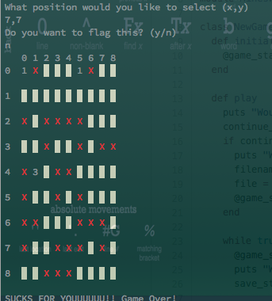
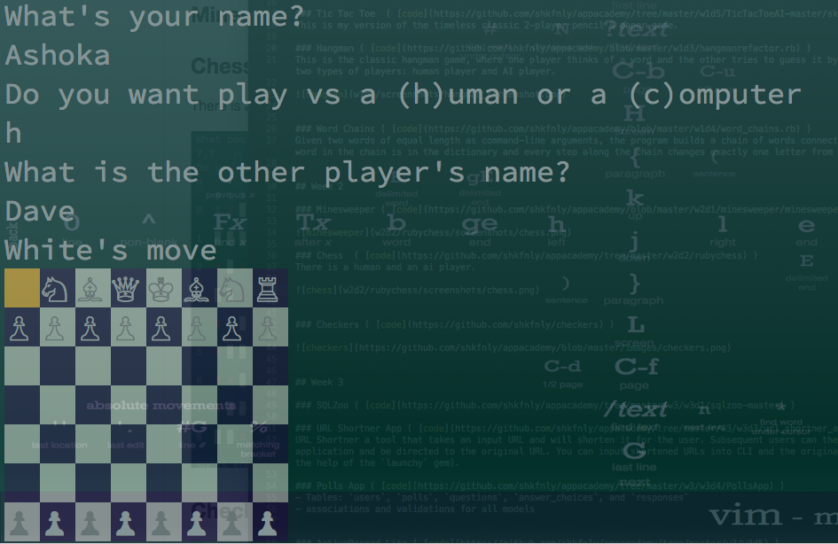

####This repository contains work that I completed in the course of App Academy

## Prep Work for App Academy

### Twitter Clone ( [code](https://github.com/shkfnly/sample_app) | [demo](fvbkireh.herokuapp.com) )
This is the sample application for the
[*Ruby on Rails Tutorial:
Learn Web Development with Rails*](http://www.railstutorial.org/)
by [Michael Hartl](http://www.michaelhartl.com/).

## Week 1

### Towers of Hanoi ( [code](https://github.com/shkfnly/appacademy/blob/master/w1d1/towers_of_hanoi.rb) )

### Mastermind ( [code](https://github.com/shkfnly/appacademy/blob/master/w1d3/mastermind.rb) )

### Tic Tac Toe  ( [code](https://github.com/shkfnly/appacademy/tree/master/w1d5/TicTacToeAI-master/skeleton) )
This is my version of the timeless classic 2-player pencil & paper game.

### Hangman ( [code](https://github.com/shkfnly/appacademy/blob/master/w1d3/hangmanrefactor.rb) )
This is the classic hangman game, where one player thinks of a word and the other tries to guess it by suggesting letters. The program has two types of players: human player and AI player. 

### Word Chains ( [code](https://github.com/shkfnly/appacademy/blob/master/w1d4/word_chains.rb) )
Given two words of equal length as command-line arguments, the program builds a chain of words connecting the first to the second. Each word in the chain is in the dictionary and every step along the chain changes exactly one letter from the previous word.

## Week 2

### Minesweeper ( [code](https://github.com/shkfnly/appacademy/blob/master/w2d1/minesweeper/minesweeper.rb) )

### Chess  ( [code](https://github.com/shkfnly/appacademy/tree/master/w2d2/rubychess) )
There is a human and an ai player.

### Checkers ( [code](https://github.com/shkfnly/appacademy/tree/master/w2d4/checkers/solution) )

## Week 3

### SQLZoo ( [code](https://github.com/shkfnly/appacademy/tree/master/w3d1/sqlpractice/skeleton/lib) )

### URL Shortner App ( [code](https://github.com/shkfnly/appacademy/tree/master/w3d3/UrlShortener) )
URL Shortner a tool that takes an input URL and will shorten it for the user. Subsequent users can then give the shortened URL back to the application and be directed to the original URL. You can input shortened URLs into CLI and the original URL pops open in a browser (with the help of the `launchy` gem).

### Polls App ( [code](https://github.com/shkfnly/appacademy/tree/master/w3d4/PollsThing) )
- Tables: `users`, `polls`, `questions`, `answer_choices`, and `responses`
- associations and validations for all models

## Week 4

### Blogger ( [code](https://github.com/shkfnly/twitterclientexample) )
JumpStart blogger tutorial, which can be found at [JumpStart Lab](http://tutorials.jumpstartlab.com/projects/blogger.html).

### Contacts API ( [code](https://github.com/shkfnly/appacademy/tree/master/w4/w4d1/routes_app) )

Contacts API is an application storing your email contacts.  Users can send requests to the API in order to create and share contacts, as well as retrieve their stored contact information.
- Tables: `users`, `contacts`, `contact_share`, `contact_group`, and `comments`

### 99 Cats ( [code](https://github.com/shkfnly/appacademy/tree/master/w4d3/ninetyninecats) )
This project is a clone of the dress rental website 99dresses. In other words: it is an airbnb for renting cats.

### Music App ( [code](https://github.com/shkfnly/appacademy/tree/master/w4d4/musicapp)

A simplified version of a rdio-like app for browsing music. It is an inventory system for record labels. This app lets users track their Bands, Albums and Tracks.

### Reddit App ( [code](https://github.com/shkfnly/appacademy/tree/master/w4d5/reddit)

If you don't know what the Reddit is, then you are probably someone with a life.

## Week 5

### Goal Setter App ( [code](https://github.com/shkfnly/appacademy/tree/master/w5d1/GoalApp))

This project's main focus was on improving my skills in:
- writing integration tests using `Capybara` and `RSpec`
- learning how to develop one feature at a time
- using concerns and polymorphic associations to dry up code

### Rails Lite ( [code](https://github.com/shkfnly/appacademy/tree/master/w5d2/skeleton) )

I built my own lite version of Rails.
- used `WEBrick` to set my own server
- parse request
- route request to the appropriate controller
- send response back to the client

## Week 6
Javascript projects

### Towers of Hanoi ( [code](https://github.com/shkfnly/appacademy/tree/master/w5d5/hanoi) )
### Tic Tac Toe ([code](https://github.com/shkfnly/appacademy/tree/master/w5d5/ttt))

## Week 7

### Pokedex ( [code](https://github.com/shkfnly/appacademy/tree/master/w7d2/pokedex2) )

### TrelloClone ( [code](https://github.com/shkfnly/appacademy/tree/master/w7d5/trello) )

## Final Project ( [code](https://github.com/shkfnly/tentacle) | [live](https://tentacleio.herokuapp.com/) )

[Tentacle](https://tentacleio.herokuapp.com/)

In short: Github Integration with Task management
This app was created to establish the ability to track project tasks with github. It allows for the checking of tasks against the git commit history. If the commit message matches the task then the task is removed.